Capstone Project
================
Fábio Silva
2022-08-26

## 1. Ask

Bellabeat is a high-tech manufacturer of health-focused products for
women.

I am going to be exploring and analyzing data concerning
activity-trackers. This data will involve user activity, sleep, and
stress, across multiple days.

I will explore trends and find patterns that can provide insights and
hopefully guide future decisions/strategies employed by the marketing
team.

As well as being presented to the marketing team, this data will also be
presented to both stakeholders of Bellabeat, namely Urška Sršen and
Sando Mur.

## 2. Prepare

The data used here is stored in
[Kaggle](https://www.kaggle.com/datasets/arashnic/fitbit), and concerns
a total of 33 “respondents to a distributed survey via Amazon Mechanical
Turk between 03.12.2016-05.12.2016”.

It encompasses the following information:  
- *Physical activity*  
- *Heart rate*  
- *Sleep monitoring*  
- *Caloric intake*

One significant limitation of the data is that it is limited sample size
of 33 participants, which is why any conclusions derived here should be
taken with this in consideration.

This data is distributed across 18 comma-separated values (csv) files,
with data stored in a long-format.

The above data verification was performed in R, but was not included in
this report.

## 3. Process

To process the data I am using R. I began by importing the required
data, then cleaning the data.  
The cleaning process (as described below), involved checking for NA
values, duplicates, merging the data and tidying up the date format.

**Packages and configurations**  
Packages and general configurations

``` r
rm(list = ls()) # cleans environments
setwd('C:/Users/fabio/OneDrive/My Things/Stats/Courses/Coursera/GoogleDataAnalytics/Module8/project')
library(tidyverse)  # tidyverse
theme_set(theme_classic())  # setting ggplot2 theme
```

**Listing data**  
Listing all the data available

``` r
# Reading all data files in data folder
list_of_files <- list()
list_all_data <- dir(path = paste(getwd(), sep='', '/data'), pattern='.csv')
for (file in list_all_data){
  list_of_files <- c(list_of_files, as.character(file))
}

list_of_files <- unlist(list_of_files)

cat('Total data files:', length(list_of_files))
```

### 3.1. Daily data

**Loading data**  
I loaded the “dailyActivity_merged.csv” data, since it has already the
other daily info (calories, intensity, steps) together.  
I also loaded the “sleepDay_merged.csv” data. This will be merged with
the dataframe above, providing also info about sleep on each day.

``` r
setwd("C:/Users/fabio/OneDrive/My Things/Stats/Courses/Coursera/GoogleDataAnalytics/Module8/project/data")

daily_act <- as.tibble(read.csv(list_of_files[1]))  # daily activity
```

    ## Warning: `as.tibble()` was deprecated in tibble 2.0.0.
    ## Please use `as_tibble()` instead.
    ## The signature and semantics have changed, see `?as_tibble`.
    ## This warning is displayed once every 8 hours.
    ## Call `lifecycle::last_lifecycle_warnings()` to see where this warning was generated.

``` r
daily_slp <- as.tibble(read.csv(list_of_files[17]))  # daily sleep
```

**Cleaning**  
So I began by checking the number of NAs in the total dataset. Since no
NA value was reported, there was no need to further inspect where the NA
was (which column and row).  
I then checked for duplicates, finding 3 duplicates in the daily sleep
data, which was then removed.

``` r
# checking for NAs
daily_act %>% 
  is.na() %>%
  sum()

daily_slp %>% 
  is.na() %>% 
  sum()

# checking for number of distinct IDs
length(unique(daily_act$Id))  # 33 unique IDs
length(unique(daily_slp$Id))  # 23 unique IDs


# checking duplicates
sum(duplicated(daily_act))  # 0
sum(duplicated(daily_slp))  # 3


# removing duplicates
daily_slp <- daily_slp %>% 
  mutate(DUP = duplicated(daily_slp)) %>% 
  filter(DUP == FALSE) %>% 
  mutate(DUP = NULL)

sum(duplicated(daily_slp))  # 0 now
```

**Merging**  
After doing the above, I proceeded to merge the dataframes.  
I firstly had to arrange the date information present in the daily sleep
data, and then proceeded to join both dataframes (daily activity and
sleep) by ID and Date.  
I finished by formatting the date column to a date format (it previously
was as character). Lastly, I created a column with the days of the week.

**Note**: We went from 24 to 31 participants with this, since the daily
sleep data only had information regarding 24 participants.

``` r
# preparing
daily_slp <- daily_slp %>% 
  separate(SleepDay, sep = ' ', into = c('Day', 'Hour', 'AMPM')) %>% 
  mutate(Hour = NULL,
         AMPM = NULL)

colnames(daily_act)[2] <- 'Day'

# merging (INNER JOIN)
df_daily <- daily_act %>% 
  merge(daily_slp, by = c('Id', 'Day')) %>% 
  as_tibble()


# formatting date
df_daily$Day <- as.Date(df_daily$Day, format = "%m/%d/%y")

# days of the week
df_daily$WeekDay <- weekdays(df_daily$Day)

df_daily <- df_daily %>% 
  mutate(WeekDay = recode(WeekDay, 
                            "segunda-feira" = 'Monday',
                            "terça-feira" = 'Tuesday',
                            "quarta-feira" = 'Wednesday',
                            "quinta-feira" = 'Thursday',
                            "sexta-feira" = 'Friday',
                            "sábado" = 'Saturday',
                            "domingo" = 'Sunday'))
```

**Simplifying unique IDs**  
To simplify data viewing, I replaced the 10 numerals that characterized
each participants’ ID by a simpler number (from 1 to 24).

``` r
id_list <- c()
ind <- 0
id_final_list <- c()

for (id in df_daily$Id){
  if (id %in% id_list){
    id_final_list <- c(id_final_list, ind)
  } else {
    id_list <- c(id_list, id)
    ind <- ind + 1
    id_final_list <- c(id_final_list, ind)
  }
}

df_daily <- df_daily %>% 
  mutate(ID = as.factor(id_final_list),
         Id = NULL)


# organizing columns to place ID first
df_daily <- df_daily[, c(ncol(df_daily), 1:ncol(df_daily) - 1)]
```

### 3.2. Hour data

I loaded three data files containing data on calories, activity
intensity and steps taken, all across each hour of each day recorded. I
merged these dataframes into one, by ID and hour of activity.

**Loading hour data**

``` r
setwd('C:/Users/fabio/OneDrive/My Things/Stats/Courses/Coursera/GoogleDataAnalytics/Module8/project/data')
# Loading data
hour_cal <- read.csv('hourlyCalories_merged.csv')
hour_int <- read.csv('hourlyIntensities_merged.csv')
hour_ste <- read.csv('hourlySteps_merged.csv')

hour_cal$Id <- as.character(hour_cal$Id)
hour_int$Id <- as.character(hour_int$Id)
hour_ste$Id <- as.character(hour_ste$Id)

# Merging
df_hour <- hour_cal %>% 
  merge(hour_int, by = c('Id', 'ActivityHour')) %>% 
  merge(hour_ste, by = c('Id', 'ActivityHour')) %>% 
  as_tibble()
```

Creating a proper date column (if needed) and an hour column.

``` r
# Setting date properly
df_hour <- df_hour %>% 
  separate(ActivityHour, sep = ' ', into = c('Day', 'Hour', 'AMPM')) %>%
  separate(Hour, sep = ':', into = c('Hour', 'Minute', 'Second')) %>% 
  mutate(Minute = NULL,
         Second = NULL) %>% 
  mutate(Hour = as.numeric(Hour)) %>% 
  mutate(Hour = ifelse(AMPM == 'PM', Hour + 12, Hour)) %>% 
  mutate(Date = (strptime(Hour,"%H"))) %>%
  mutate(Day = NULL,
         AMPM = NULL)
```

## 4. Analyze & Share

We split the analysis part into two sets, daily and hour analysis.

### 4.1. Daily analysis

Here I explore how several factors regarding physical activity
influences sleep patterns.  
**Exploratory plots**

``` r
# Total minutes active and total minutes asleep
a <- df_daily %>% 
  mutate(TotalMinutesActive = LightlyActiveMinutes +
           FairlyActiveMinutes + VeryActiveMinutes) %>% 
  ggplot(aes(TotalMinutesActive, TotalMinutesAsleep)) +
  geom_point() +
  geom_smooth(method = 'lm', formula = 'y ~ x') +
  labs(x = 'Total Minutes Active', y = 'Total Minutes Asleep')


# Total sedentary minutes and total minutes asleep
b <- df_daily %>% 
  ggplot(aes(SedentaryMinutes, TotalMinutesAsleep)) +
  geom_point() +
  geom_smooth(method = 'lm', formula = 'y ~ x') + 
  labs(x = 'Total Minutes Sedentary', y = 'Total Minutes Asleep')

# Delta active vs sedentary to total minutes asleep
c <- df_daily %>% 
  mutate(TotalMinutesActive = LightlyActiveMinutes +
           FairlyActiveMinutes + VeryActiveMinutes) %>% 
  mutate(ActiveToSedentary = TotalMinutesActive/SedentaryMinutes) %>% 
  filter(ActiveToSedentary < 1.5) %>% 
  ggplot(aes(ActiveToSedentary, TotalMinutesAsleep)) +
  geom_point() +
  geom_smooth(method = 'lm', formula = 'y ~ x') +
  labs(x = 'Active to Sedentary', y = 'Total Minutes Asleep', caption = 'Higher Active to Sedentary ratio means more acitivity during the day, compared to sedentary time')


Rmisc::multiplot(a,b,c, layout = matrix(c(1,3,2,3), 2, 2))
```

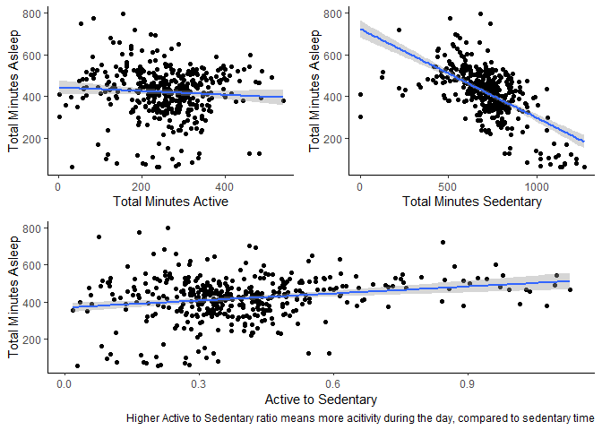<!-- -->

This brief graphical analysis seems to suggest that, while the total
minutes active seems to have little impact over total sleeping time, the
more sedentary a person is the less time the person is asleep.

**IMPORTANTLY**: This is a correlation. It needs to be considered that
it actually might be the case that people who general sleep less are
more sedentary than those who do not. We cannot establish a causal
connection, although, given the benefits of exercise on sleep, one could
speculate (but always with this in mind).

I proceeded to verify if the total steps (a measure of physical activity
during the day) a person takes was correlated with the time to fall
asleep. This later measure was calculated by subtracting the time asleep
from the time in bed.

**IMPORTANT**: This might not be a true measure, since people sometimes
spend time in bed that is not time spent trying to fall asleep. Again,
care must be taken when interpreting the results below.

``` r
# Fall Asleep Minutes
d <- df_daily %>% 
  mutate(FallAsleepMinutes = TotalTimeInBed - TotalMinutesAsleep) %>% 
  filter(FallAsleepMinutes < 100) %>% 
  ggplot(aes(TotalSteps, FallAsleepMinutes)) +
  geom_point() +
  geom_smooth(method = 'lm', formula = 'y ~ x')

d
```

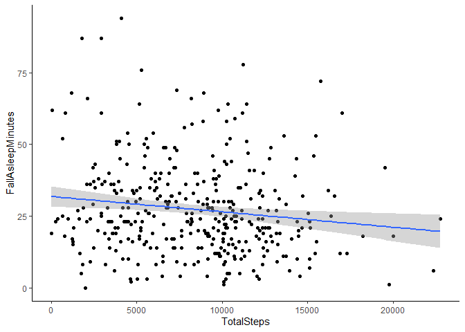<!-- -->

It also seems that the more steps one takes, the easier it is to fall
asleep, albeit the tendency is not that strong and the consideration
raised above needs to be taken into account.

**Categorizing participants and days according to activity**  
Here I created categories for participants according to their level of
physical activity and checked if people who are more active sleep more
than those who are less active.

``` r
# Quantile distribution of Active To Sedentary ratio to properly categorize participants
df_daily %>% 
  mutate(TotalMinutesActive = LightlyActiveMinutes +
           FairlyActiveMinutes + VeryActiveMinutes) %>% 
  mutate(ActiveToSedentary = TotalMinutesActive/SedentaryMinutes) %>% 
  summarise(quantiles = round(quantile(ActiveToSedentary), 1))
```

``` r
# Ploting
df_daily %>% 
  mutate(TotalMinutesActive = LightlyActiveMinutes +
           FairlyActiveMinutes + VeryActiveMinutes) %>% 
  mutate(ActiveToSedentary = TotalMinutesActive/SedentaryMinutes) %>% 
  mutate(ActiveCategory = ifelse(ActiveToSedentary <= .3, 'Little Active',
                                 ifelse(ActiveToSedentary > .3 & ActiveToSedentary <= .4,
                                        'Moderately Active', 'Highly Active'))) %>% 
  ggplot(aes(fct_reorder(ActiveCategory, TotalMinutesAsleep), TotalMinutesAsleep)) +
  stat_summary(fun = mean, geom = 'bar', width =.5 ) +
  coord_cartesian(ylim = c(300, 500)) + 
  labs(x = 'Active category',y = 'Total Minutes Asleep')
```

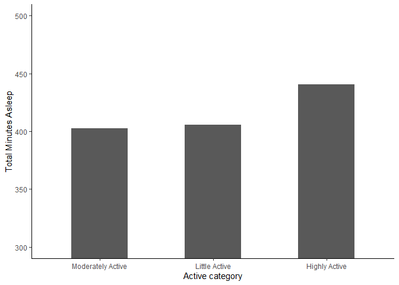<!-- -->

We can see that highly active people do indeed appear to sleep more than
those who are moderate to little active.

**Average steps taken per day of the week**  
Now I explored in which days of the week people are most active and most
sedentary.

``` r
df_daily %>% 
  ggplot(aes(fct_reorder(WeekDay, TotalSteps), TotalSteps, fill = WeekDay)) + 
  geom_violin(alpha = .5) + 
  geom_boxplot(alpha = 0, width = .2) +
  guides(fill = "none") +
  labs(x = 'Day of the week', y = 'Total Steps')
```

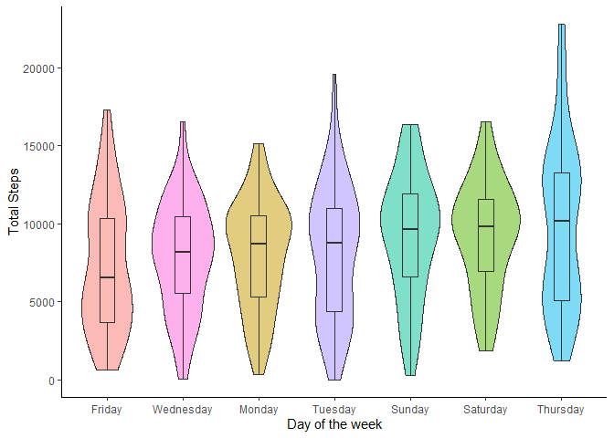<!-- -->

Here we see that people generally take more steps on Thursday and less
steps are taken on Friday.

**Most sedentary days**

``` r
df_daily %>% 
  ggplot(aes(fct_reorder(WeekDay, SedentaryMinutes), SedentaryMinutes, fill = WeekDay)) + 
  geom_violin(alpha = .5) + 
  geom_boxplot(alpha = 0, width = .2) +
  guides(fill = "none") +
  labs(x = 'Day of the week', y = 'Sedentary Minutes')
```

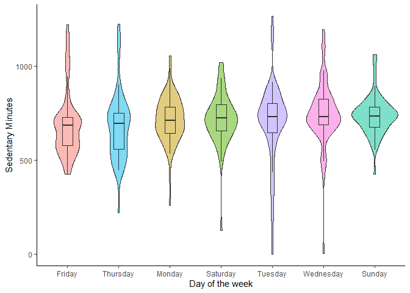<!-- -->

As for sedentary time, as expected, people tend to be more sedentary on
Sundays. Contrary to the plot above, albeit taking less steps, people
are, on average, more active on Fridays.

Now I inspected how the average time spent in the different types of
activity (Lightly, Fairly and Very Active) vary per day of the week.

``` r
# Reordering levels
df_daily$WeekDay <- factor(df_daily$WeekDay,
                           levels=c('Monday', 'Tuesday', 'Wednesday',
                                    'Thursday', 'Friday', 'Saturday',
                                    'Sunday'))
# Renaming for smaller names
levels(df_daily$WeekDay) <- c('Mon', 'Tue', 'Wed',
                                    'Thu', 'Fri', 'Sat',
                                    'Sun')

df_daily %>%
  select(ID, WeekDay, LightlyActiveMinutes, FairlyActiveMinutes, VeryActiveMinutes) %>% 
  pivot_longer(cols = c(LightlyActiveMinutes, FairlyActiveMinutes, VeryActiveMinutes),
               names_to = 'IntensityOfActivity', values_to = 'MinutesSpent') %>% 
  ggplot(aes(WeekDay, MinutesSpent)) + 
  stat_summary(fun = mean, geom = 'point') + 
  stat_summary(fun = mean, geom = 'line', aes(group = 1)) +  
  facet_wrap(~IntensityOfActivity, scales = 'free_y') +
  guides(fill = "none") +
  labs(x = 'Day of the week', y = 'TotalMinutesActive')
```

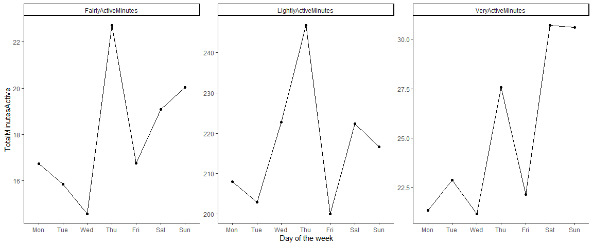<!-- -->

We can see that for Thursday sees to be the day with the most Light to
Fairly active minutes. Whilst the weekend is the time where most people
do the most type of intense activities.

**Activity throughout the day**  
Below I inspect the types of users, in terms of logged activities per
day, there are in this data

``` r
df_daily %>% 
  group_by(ID) %>% 
  count()

quantile(table(df_daily$ID))
```

``` r
df_daily %>% 
  group_by(ID) %>% 
  summarise(entries = n()) %>% 
  mutate(TypeOfUser = ifelse(entries < 5, 'Little Active',
                             ifelse(entries >= 5 & entries < 27, 'Moderately Active',
                                    'Highly Active'))) %>% 
  group_by(TypeOfUser) %>% 
  count() %>% 
  ggplot(aes(TypeOfUser, n)) +
  geom_col(width = .5) + 
  coord_cartesian(ylim = c(0, 12))
```

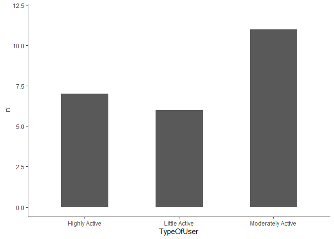<!-- -->

Now I classified each ID in the main data, giving it a the correct label
according to their number of logged activities.

``` r
# Creating the classification per ID
type_of_user <- df_daily %>% 
  group_by(ID) %>% 
  summarise(entries = n()) %>% 
  mutate(TypeOfUser = ifelse(entries < 5, 'Little Active',
                             ifelse(entries >= 5 & entries < 27, 'Moderately Active',
                                    'Highly Active'))) %>% 
  select(TypeOfUser) %>% 
  as.list() 

# Adding it to the main dataframe
ind <- 1
user_list <- c()
for (id in unique(df_daily$ID)){
  user_list <- c(user_list, rep(type_of_user$TypeOfUser[ind], sum(df_daily$ID == id)))
  ind <- ind + 1
}

df_daily$TypeOfUser <- user_list
```

I then explored how activity intensities, steps, etc. are different
according to the type of user in question (number of log activities of
the user).

``` r
df_daily %>% 
  group_by(TypeOfUser) %>% 
  summarise(MeanSteps = mean(TotalSteps), .groups = 'drop') %>% 
  ggplot(aes(TypeOfUser, MeanSteps)) +
  geom_col(width = 0.5) + 
  coord_cartesian(ylim = c(2500, 10000)) + 
  labs(x = 'Type of User', y = 'Mean Steps')
```

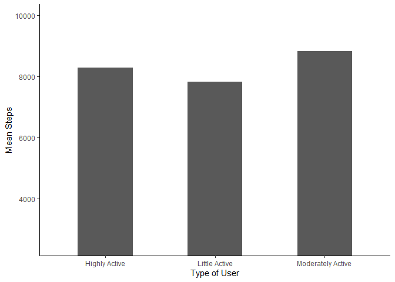<!-- -->

``` r
df_daily %>% 
  group_by(TypeOfUser, WeekDay) %>%
  summarise(NumberOfActivities = n(), .groups = 'drop') %>% 
  ggplot(aes(WeekDay, NumberOfActivities)) + 
  geom_col(width = 0.5) + 
  facet_wrap(~TypeOfUser) + 
  labs(x = 'Day of the Week', y = 'Number of activities logged')
```

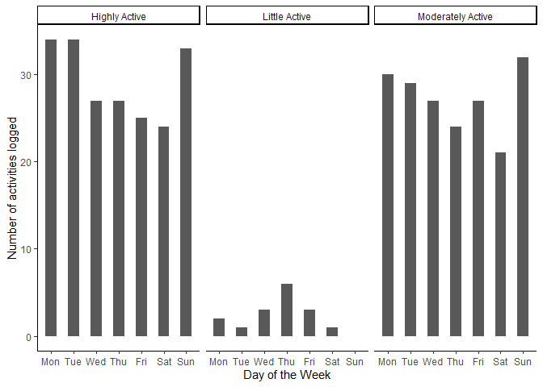<!-- -->

``` r
df_daily %>% 
  group_by(TypeOfUser) %>% 
  summarise(MeanTimeAsleep = mean(TotalMinutesAsleep)) %>% 
  ggplot(aes(TypeOfUser, MeanTimeAsleep), .groups = 'drop') +
  geom_col(width = 0.5) + 
  coord_cartesian(ylim = c(200, 500)) + 
  labs(x = 'Type of User', y = 'Average time asleep')
```

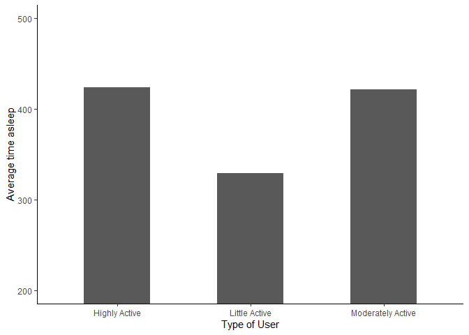<!-- -->

So in these three plots we can see that:  
- Moderate users tend to have the highest number of steps, with little
active users have the less average steps taken in each logged
activity.  
- Whilst highly and moderately active users prefer to log activities
during the beginning of the week and on Sundays, lightly active users
tend to log more activities during the middle of the week.  
- Little active users tend to sleep less than moderately and highly
active users.

### 4.2. Hour analysis

**Average intensity per hour**  
We began by exploring the average intensity of physical activity per
hour of the day.

``` r
df_hour %>% 
  group_by(Hour) %>% 
  summarise(AverageIntensity = mean(TotalIntensity),
            AverageCalories = mean(Calories), .groups = 'drop') %>% 
  ggplot(aes(x = Hour, y = AverageIntensity)) + 
  geom_point(color = 'blue', size = 2) + 
  geom_line(aes(group = 1), alpha = .5) + 
  geom_vline(xintercept = 12, linetype = 'dashed', color = 'red')  + 
  labs(x = 'Hour of the day', y = 'Average Intensity',
       caption = 'Red dashed line signals midday') + 
  coord_cartesian(xlim = c(0, 23))
```

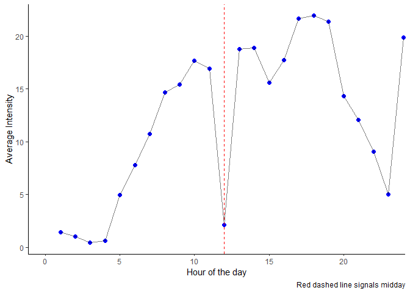<!-- -->

We can see that activity starts at around 5am, with a big drop-off at
noon, and then rises back up till about 7pm, with a sudden increase at
midnight (a suprising find).

**Average intensity per time of day**  
Now I explored the mean physical activity per time of the day (Morning,
Afternoon and Night).

``` r
df_hour %>% 
  mutate(TimeOfDay = ifelse(Hour > 5 & Hour <= 12, 'Morning',
                            ifelse(Hour > 12 & Hour < 20, 'Afternoon',
                                   'Night'))) %>% 
  group_by(TimeOfDay) %>% 
  summarise(AverageIntensity = mean(TotalIntensity),
            AverageCalories = mean(Calories), .groups = 'drop') %>% 
  arrange(AverageIntensity)
```

    ## # A tibble: 3 × 3
    ##   TimeOfDay AverageIntensity AverageCalories
    ##   <chr>                <dbl>           <dbl>
    ## 1 Night                 6.83            83.7
    ## 2 Morning              12.2             97.6
    ## 3 Afternoon            19.4            117.

We can see that people are on average more active during the afternoon,
followed by morning and night. These pattern, as expected, is also seen
for calories spent.

**Average Calories Spent By Intensity during different times of day**  
Now, if, perhaps, certain times of the day are associated with a more
calorie expensive workout per intensity. For instance, is an average
physical intensity associated with a bigger expense of calories during
the afternoon compared to the morning time?

``` r
df_hour %>% 
  mutate(TimeOfDay = ifelse(Hour > 5 & Hour <= 12, 'Morning',
                            ifelse(Hour > 12 & Hour < 20, 'Afternoon',
                                   'Night'))) %>% 
  group_by(TimeOfDay, AverageIntensity) %>% 
  summarise(Calories = mean(Calories), .groups = 'drop') %>%
  filter(AverageIntensity %in% c(0.5, 1, 1.5, 2, 2.5)) %>% 
  arrange(AverageIntensity, Calories)
```

    ## # A tibble: 12 × 3
    ##    TimeOfDay AverageIntensity Calories
    ##    <chr>                <dbl>    <dbl>
    ##  1 Morning                0.5     134.
    ##  2 Night                  0.5     137.
    ##  3 Afternoon              0.5     141.
    ##  4 Night                  1       198.
    ##  5 Morning                1       209.
    ##  6 Afternoon              1       223 
    ##  7 Morning                1.5     242 
    ##  8 Afternoon              1.5     274.
    ##  9 Night                  1.5     310.
    ## 10 Morning                2.5     363 
    ## 11 Afternoon              2.5     370.
    ## 12 Night                  2.5     616

This table appears to suggest that the same physical exercise is
associated with a bigger calorie expense during the afternoon for light
intensity and night-time for more moderate to extreme intensities.
Althought these results show little differences (perhaps meaningless)
and are hard to interpret.

Here are the results in a graphical form.

``` r
# df_hour %>% 
#   ggplot(aes(TotalIntensity, Calories)) + 
#   geom_point() 

a <- df_hour %>% 
  mutate(TimeOfDay = ifelse(Hour > 5 & Hour <= 12, 'Morning',
                            ifelse(Hour > 12 & Hour < 20, 'Afternoon',
                                   'Night'))) %>% 
  group_by(TimeOfDay, AverageIntensity) %>% 
  summarise(Calories = mean(Calories), .groups = 'drop') %>% 
  ggplot(aes(AverageIntensity, Calories)) +
  geom_point() + 
  geom_smooth(method = 'loess', formula = 'y ~ x') + 
  facet_wrap(~TimeOfDay) +
  labs(x = 'Average Intensity of Acitivity Per Hour')

b <- df_hour %>% 
  mutate(TimeOfDay = ifelse(Hour > 5 & Hour <= 12, 'Morning',
                            ifelse(Hour > 12 & Hour < 20, 'Afternoon',
                                   'Night'))) %>% 
  group_by(TimeOfDay, StepTotal) %>% 
  summarise(Calories = mean(Calories), .groups = 'drop') %>% 
  ggplot(aes(StepTotal, Calories)) +
  geom_point() + 
  geom_smooth(method = 'loess', formula = 'y ~ x') + 
  facet_wrap(~TimeOfDay) + 
  labs(x = 'Total Steps Per Hour')
  
Rmisc::multiplot(a,b)
```

<!-- -->

These patterns are interesting. One can see that for moderate to high
intensity there is a more calorie expense during the night time and
afternoon compared to the morning time. Again this might be a spurious
association, particularly given the low sample size, but nevertheless
paints an interesting pattern.

## 5. Act

### 5.1. Summary

Here’s a list of insights taken from this brief analysis:

**1.** More time being sedentary has a clear association with decreased
sleep times. This might imply that less time being sedentary might
improve sleep quality.

**2.** More steps taken during the day is associated with less time to
fall asleep.

**3.** Being highly active, but not moderately active, is associated
with more sleep time, compared to being little active.

**4.** Friday is the day of the week with the least steps taken, but
actually has the least sedentary rate.

**5.** Most intense activities are done on weekends, whilst Thursday is
where most light to moderate activity happens.

**6.** Highly and moderately active users share the same pattern for
preferred activity days (Sunday and beginning of the week), compared to
little active users (middle of the week).

**7.** Moderately and highly active users tend to get more hours asleep
compared to little active users.

**8.** Most activity happens around 6pm, with the least activity (aside
from night-time) happening around noon (lunch time).

**9.** Most intense workouts happen during the afternoon, followed by
morning and night-time.

**10.** For moderate to high intensity activity there appears to be a
bigger calorie expense in the afternoon and night-time compared to
morning time. This finding, however, can have multiple explanations.

### 5.2. Recomendations

Considering the limitations highlighted throughout this report, I feel
that some recommendations can still be brought forward.

**A.** Reminding people, via notifications, of their average sleeping
time during days of high physical activity compared to those with low
physical activity, might encourage people to workout more regularly.

**B.** Creating a minimum steps to beat for each week based on the prior
week might be a good idea. Reminders and encouragements could be
tailored to the days people have most trouble being physically active.

**C.** Remind people, via notifications, of their usual workout hours,
could aid in improving routines and establishing an habit.

## End

This brief report was a mere example of small analysis for the Capstone
project of the “Google Data Analytics Course”.  
Its done on on real data from a true company. It is meant more to
highlight my reporting abilities, and less so on providing true (given
the limited sample size and types of data) recommendations and actions.
